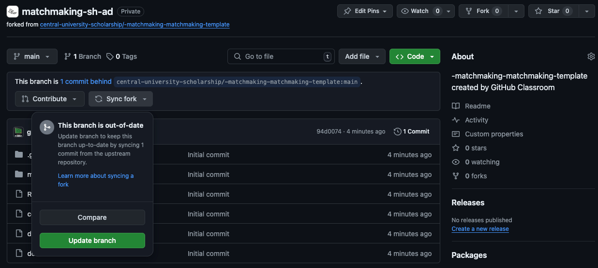

# Описание v3

Представь, что ты разработчик игры, в которой сталкиваются две команды из пяти игроков. Каждая команда состоит из пяти
ролей: верхняя (top), средняя (mid), нижняя (bot), поддержка (sup), лес (jungle).

### Задача

Создать сервис, который бы подбирал игроков в команду на основе их предпочтений и MMR

Для этого вам нужно учитывать метрики:

- MМР — Matchmaking Rating (рейтинг игрока, полученный в процессе игры), числовой эквивалент навыков игрока;
- Проранжированный список позиций;
- Время ожидания в очереди.

### Оценивание

Тестирующая система оценивает:

- Честность матча (шансы победить должны быть 50%±1%);
- Предпочитаемые позиции (игроки ранжируют позиции наиболее комфортным для себя образом);
- Скорость поиска (игроки не должны быть в очереди слишком долго).

### Механика оценивания

#### Помните, что задание - это мат.модель, приближение реального мира и ваш личный опыт может ему несоответсвовать

- В зачёт идёт последний запуск CI перед дедлайном (должен сотаться артефакт, пример будет позже)
- Все сформированные матчи, которые вы отправили будут анализироваться по трём параметрам
- По каждому параметру выстраивается рейтинг всех участников контеста, после этого выставляются баллы
    - Честность матча = медиана между рейтингами команд + сумма разниц в mmr по ролям
      - Медиана между рейтингами команд - положительное число, взять 
      - Сумма разниц в mmr по ролям - положительное число
    - Предпочитаемая позиция = сумма значений удовлетворенности игроков
      - 3, если игрок на первой в списке
      - 5, если на второй в списке
      - 8, если на третьей в списке
      - 13, если на четвертой в списке
      - 21, если на пятой в списке
    - Скорость поиска = сумма всего времени ожидания, с учётом пауз между эпохами
      - Время считается в секундах
      - Паузы между эпохами разные и их значение вам не будет известно

### Тестирование

- Задание должно выполняться в отдельной ветке, например, ``develop``, тесты запускаются при создании Pull Request в
  ветку ``main``
- Запуски тестов можно посмотреть во вкладке Actions, важно, чтобы к моменту сдачи они проходили успешно т.е. были "
  зеленые"
- Ваше решение будет тестироваться, как на открытых тестовых данных в папке `tests`, так и на закрытых, которые будут
  добавлены во время выполнения CI

#### Локальное тестирование

- Для локального тестирования вам нужно установить [Podman](https://podman.io/)
  или [Docker](https://www.docker.com/products/docker-desktop)

# [Документация](docs/docs.md)

# Схема взаимодействия

1) Отправляете GET запрос на `/matchmaking/match` с параметрами `test_name` и `epoch`
2) Распределяете полученных пользователей по командам
3) Отправка POST запроса на `/matchmaking/match` с параметрами `test_name` и `epoch` и данными о командах. В ответе
   получаете `new_epoch`, который теперь используете в новых запросах
4) Повторяете пункты 1-3, пока `new_epoch` не будет равен `00000000-0000-0000-0000-000000000000`
5) Повторяете, пока не закончатся тесты

## Важно

- Вам нельзя ничего менять в папках `\.github` и `\server`, иначе работа будет аннулирована
- Не обязательно распределять всех игроков по командам, но их должно остаться <= 9
- Все работы будут проверены на плагиат, организаторы оставляют за собой право дисквалифицировать всех замеченных в этом участников
  - p.s. если решить задачу ИИ, скорее всего она сгенерит нечто похожее и вы можете попасть под санкции, поэтому описывайте для чего вы применяете AI в файле AI.md

# OpenSource
- Сообщество разработчиков и прогресс человечества в сфере создания ПО тесно связаны с таким явлением, как OpenSource. Огромное количество привычных вам вещей используют результаты трудов энтузиастов
- Если у вас есть время и силы, можете сделать это задание немного лучше и законтребьютить в [OPEN-CU](https://github.com/open-cu/central-university-scholarship)
- Никаких преференций за это не предполагается, только уважение от других участников сообщества_)

# FAQ

### Что делать, если задание обновилось?

Вам нужно нажать `Synk fork`, а дальше `Update branch`

